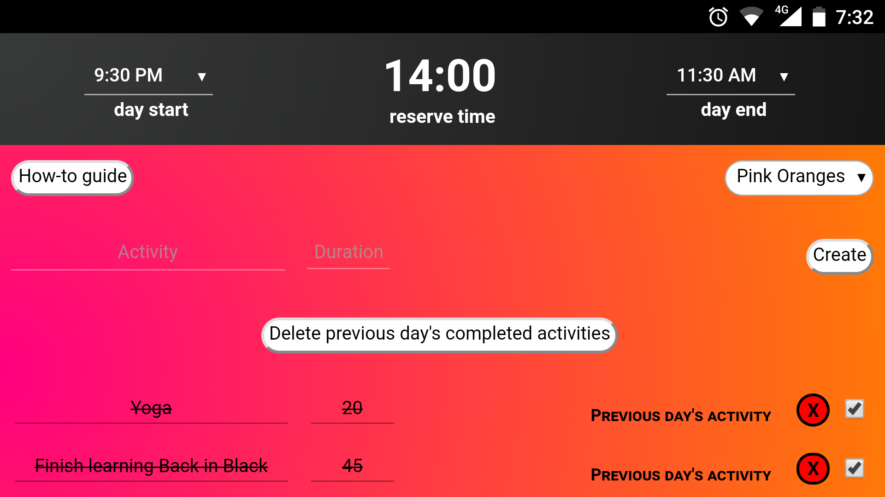

# Time Bend

**Try out the web version [here](https://time-bend.netlify.com/).**

[Here](https://neelkamath.notion.site/time-bend-hybrid-android-app-demo)'s the demo.

This is a cross-platform mobile and web app for Chetan Surpur's technique of [time bending](https://www.google.com/url?sa=t&rct=j&q=&esrc=s&source=web&cd=1&cad=rja&uact=8&ved=2ahUKEwi8m7ONzrPfAhXYa94KHaukBw0QFjAAegQICRAB&url=http%3A%2F%2Fchetansurpur.com%2Fblog%2F2012%2F10%2Ftime-bending.html&usg=AOvVaw2584-fWlB1HTkSybKr876d). I have rewritten this project to run natively [here](https://github.com/neelkamath/time-bend-android).

## Installation

1. Install the [Cordova CLI](https://cordova.apache.org/docs/en/latest/guide/cli/index.html#installing-the-cordova-cli).
1. Install the [Android Dependencies](https://cordova.apache.org/docs/en/latest/guide/platforms/android/index.html#installing-the-requirements).
1. Clone the repository using one of the following methods.
    - SSH: `git clone git@github.com:neelkamath/time-bend.git`
    - HTTPS: `git clone https://github.com/neelkamath/time-bend.git`
1. `cd time-bend/src`
1. `cordova prepare`

## Usage

### Web

Open `src/www/index.html` in your browser.

### Android

1. `cd time-bend/src`
1. `cordova build android`

The APK will be located at `time-bend/src/platforms/android/app/build/outputs/apk/debug/app-debug.apk`.

## License

This project is under the [MIT License](LICENSE).
